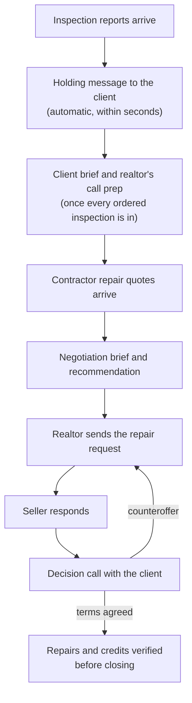

# Harbour

A client-facing dashboard that makes a real estate transaction feel processed
instead of hectic. It's built by a practicing real estate agent, who is also
its first tenant.

**Live:** https://harbour-dashboard-ten.vercel.app
**Status:** discovery phase, in production with a live pilot client

Buying or selling a home means weeks of silence punctuated by jargon. The client
doesn't know what's happening, so they call their agent, who repeats the same
status update to every client. Harbour gives the client a place to look: where
their transaction stands, what happens next in plain language, the homes
they've toured with their agent's notes, and, for a **move-up buyer** carrying
a sale and a purchase at once, how the two timelines relate and where the
coordination risk sits.

That last case is why the product exists. A pure buyer has one timeline, and so
does a pure seller. A move-up buyer has two that must land in the right order,
and no generic status tracker handles that. Harbour is built for the hard case,
and the simpler ones come along for free.

The data model has been multi-tenant since day one. The eventual play is B2B2C:
other agents as paying customers, their clients as end users.

## How it's being run

Harbour is being run as a hypothesis test, not a launch.

- **Hypothesis:** move-up buyers with self-serve visibility into both
  transactions will visit habitually and feel more in control, without feeling
  less personally attended to.
- **Success thresholds, committed before the first client:** a median of 2+
  visits a week while a transaction is active, no client saying at close that
  they felt *less* attended to, and at least one client mentioning the
  dashboard to someone else without being prompted.
- **Riskiest assumption:** that self-serve status adds to felt care rather than
  replacing the human contact that earns referrals. High usage is a false
  positive if the relationship gets thinner.

**Where it stands:** one pilot client so far, and not yet a move-up buyer, the
case the hypothesis actually depends on. With a cohort of one, none of the
thresholds can be read yet.

### What the first real client changed

Visit tracking went in before the first client, to measure retention. The
first thing it actually produced was a usability finding. This is the first
client's first session:

```
21:11:47  /dashboard            21:12:37  /dashboard/escrow
21:12:19  /dashboard/tours      21:12:41  /dashboard/inspections
21:12:22  /dashboard/homes      21:12:56  /dashboard/financials
21:12:29  /dashboard/homes/…    21:13:52  /dashboard   (back to the start)
```

Six sections in 37 seconds, three to eight seconds each, then back to the
start. That isn't reading. It's opening doors to see what's behind them. The
overview said where they stood but nothing about what the menu contained, so the
only way to find out was to click everything. It's now a map: one plain
sentence of status, then a card per section showing what's inside. We could
never have spotted this ourselves, because we already knew what each section
held.

The reasoning behind decisions like this is in the tracking docs:
[`project.md`](project.md) (what this is, current phase),
[`strategy.md`](strategy.md) (hypothesis, measurement, design reasoning), and
[`change_log.md`](change_log.md) (what was built each day and why). Reversed
decisions are recorded as reversals, with the argument that changed them.

## What's built

**Clients** sign in to an overview that says where things stand in one plain
sentence ("You're house hunting. Your next tour is Sunday"), then shows what's
inside each section: upcoming tours with stops and times, homes seen with the
agent's notes and favorites, a stage timeline with plain-language explainers,
inspection items, key dates, and an HOA-adjusted affordability calculator based
on their pre-approval. Nothing is editable. It's a window, not a workspace.
The evening before a tour, they get one email listing every stop.

**The agent** manages everything from `/agent`: a home view of active clients
and tours that still need a debrief, a per-client page (overview, tours, homes
seen, inspections, financials), and a standalone debrief form built for a phone
in a parking lot between showings. A client's whole lifecycle, from invite to
removal, runs from the app, with nothing left to do by hand in the database.

Once a tour's time has passed it stops being upcoming and turns up under Homes
Seen as a home waiting on a debrief, carrying its address and time into the
form. That sounds like housekeeping and isn't: the debrief is the one thing the
product asks of the agent, and it gets written hours later, from memory, on a
phone. Anything it has to ask them to retype is a reason it doesn't get done.

**Both dashboards wear the agent's brokerage brand.** A client reads Harbour as
part of their agent's service, under a brand they already know, so colours are
set per agent rather than per app. The first is Sotheby's International Realty,
read from the brand's own sites: navy for the brand, gold as a small accent,
neutral backgrounds. Each brand is a designed preset rather than colours an
agent types in, because a usable palette needs more than a brand colour — text
on it, hover states, a sidebar — with contrast checked for every pair. That
check is what ruled gold text out entirely: on white it's 2.6:1, too faint to
read. Presets also fit how the industry is organised: most agents work under a
handful of franchise brands whose affiliates share one set of brand standards,
so one preset covers every agent under a brand. Red stays red whatever the
brand, because on a warning it means danger, not decoration.

## Engineering decisions worth knowing

**Private notes are unreachable to clients at the database level, not in app
code.** Agents keep candid notes on each home ("seller is motivated, don't
show your hand"). Postgres revokes read access to that column entirely for the
client role, so a client session gets `permission denied for column` even on
`select *`, whatever the app does. The only path to it is a `SECURITY DEFINER`
function that checks the caller is that client's agent. This was verified
against a local Postgres instance before being trusted.

**A buyer exists before a property does.** The buy sequence starts at "House
Hunting," with no address and no contract, because touring is the window this
product is really about and a buyer spends weeks there. `property_address` is
nullable, and each stage declares whether it requires one.

**Reminders can't double-send.** Each client-and-date pair is claimed with a
unique constraint *before* the email goes out, so a cron retry or a manual
resend can't email anyone twice. A failed send releases the claim, so failures
get retried instead of silently never sending. "Tomorrow" is calculated in the
timezone where the tours happen, not the server's (UTC), which would otherwise
skip every Pacific-coast tour before 5pm.

**When the logs say nothing is wrong, the bug is underneath the application.**
The first client's login failed three separate times, and every request
Harbour served returned success throughout. The causes were all one layer down:
a Supabase redirect silently replaced with localhost, SMTP rejecting a
password, and the client's employer's email scanner stripping the sign-in token
from the URL fragment. Moving the token into the query string fixed the last
one. Visit tracking is what proved they never reached the dashboard, even
though their auth record said the invite was accepted.

More architectural notes, the full list of database functions, and the
conventions for extending any of this are in [`CLAUDE.md`](CLAUDE.md).

## In design: the inspection agent

**The design is complete and nothing is built yet.** It's deliberately kept out
of the discovery pilot so the two don't muddy each other, and unlike the
dashboard it's designed for many agents from the start. Before any build, a
broker and a real estate attorney will review the rules for how it frames
findings. The full reasoning, including the decisions that were reversed, is
in [`strategy.md`](strategy.md).

In this section, **the AI** means the inspection agent and **the realtor**
means the human agent, to keep the two apart.

### The problem

A home inspection produces a sixty-page PDF with forty-odd flagged
"deficiencies," most of them routine. The inspector sends it to the client and
the realtor at the same moment, so the client opens it alone, counts the
problems, and panics. The expensive part isn't reading the report. It's the hour
on the phone afterward.

### How it works, from report to closing



1. **A report arrives.** Inspectors send reports to a dedicated address that
   forwards them straight into Harbour, so the AI never reads anyone's inbox.
   It matches the report to the right client, and if the match isn't exact, it
   stops and asks the realtor. A short holding message goes to the client within
   seconds: the report is in, most of what's in it is routine, and the realtor
   is reviewing it.
2. **The inspections are in.** Reports and quotes arrive in two waves. Each
   report gets its own holding message, but a brief, and the notification that
   comes with it, goes out once per wave, never once per document. The first
   wave produces a **client brief** and the realtor's **call prep**:
   - The brief ranks findings using the inspector's own severity grades. Routine
     items are collapsed, never removed.
   - When the pest or roof report prices a defect the home inspection only
     flagged, the AI proposes the match, and the realtor confirms it.
   - The call prep groups findings by root cause, names what's still unknown,
     and lays out the client's options.
   - If an ordered report is 48 hours late, the realtor is alerted. The AI never
     publishes a partial set on its own.
3. **The repair quotes are in.** A quote that only adds a price updates the
   brief. A quote that changes the story ("replace the whole system, not the
   ducts") goes to the realtor first, so the client hears it from a person. The
   AI produces a negotiation brief and a recommendation. If quotes won't arrive
   before the inspection deadline, it drafts an extension request for the
   realtor to send.
4. **The seller responds.** This can take one round or several, depending on
   the market. The AI checks the response against the request item by item and
   catches anything the seller didn't address. While the client waits, they see
   where things stand and when the seller's deadline is. They see the outcome
   only after the realtor has talked it through with them. The AI drafts
   counteroffers, and the realtor sends them.
5. **Through closing.** For each agreed repair, the AI matches a receipt to it
   and checks for a licensed contractor. Each agreed credit is checked against
   the closing statement. Anything unverified as closing approaches alerts the
   realtor, because neither a missed repair nor a missing credit can be fixed
   after closing.

### The principles behind it

- **Fast where no judgment is needed, reviewed where it is.** A flow that drafts
  and then waits for approval reaches the client after the panic has started.
  The holding message needs no judgment, so it sends immediately; everything
  substantive waits for review.
- **The AI is never the source of a fact.** Realtors aren't licensed to assess
  structures or price repairs, so every claim is attributed to an inspector, to
  general context, or to a specialist who needs to look. That makes a longer
  brief *safer* than a short one, because "minor, don't worry about it" is an
  unlicensed opinion.
- **Harbour never withholds, it only frames.** The client already has every
  report, so leaving something out protects no one. This reversed an earlier
  rule against filtering findings, and it shapes how costs read. "$10,700 in
  repairs" sounds like a bill, when at this stage it's what the buyer is asking
  the *seller* to cover. Saying so isn't spin. It's what the number is for.
- **Autonomy comes from detectors, not from trust.** Each step was scored on how
  reversible it is, how far the damage spreads (including to a client's
  confidence in their realtor), and whether a failure would be visible or
  silent. Two things always wait for the realtor: telling a client their deal
  may be at risk, and sending anything to the seller's side. Two more wait in
  specific cases: a new client's first brief, and any change to a brief the
  client has already read. Everything else runs automatically *because* a
  specific check catches its failure, and a step without one waits for a person.
- **The AI never checks its own work.** A separate critic, ideally on a
  different model, reviews every draft against the original documents without
  seeing the drafting AI's reasoning, so it can't be argued into agreement. It
  can only report problems, and only the realtor can dismiss one. It blocks
  anything bound for the client or the seller's side. This also fixed a flaw in
  an earlier version, where "show me only the exceptions" meant exceptions the
  AI had flagged about itself.
- **Every loop has a limit and a visible stop.** A loop can fail by running
  forever or by quietly stopping, so each has a maximum and a halt that alerts a
  person. Writing them out turned up a loop the design had missed: an
  out-of-office reply to one of Harbour's own emails could feed back into the
  inspection inbox and set off more mail.

### Two parts came from working a real inspection

The design sessions didn't produce the two most valuable ideas. Sitting with a
live client's reports did.

- **The same defect shows up in several reports, and only one of them prices
  it.** Matching them gives a licensed repair price with no contractor to chase.
  That overturned an earlier plan to leave cost data for a later version. The AI
  proposes matches but never merges them, because a wrong merge hides one defect
  under another's cost.
- **A story about the house for the realtor's call.** Grouping findings by root
  cause turns fourteen separate crises into one problem with one fix, which
  changes what the client thinks the problem *is*. It's also the lowest-risk
  thing the AI produces, because a licensed person retells it in their own
  words.

### What it deliberately won't do

- **Answer the client's questions.** A chat box would replace the realtor's
  call, which contradicts the riskiest assumption this whole product is testing.
  And "is this crack serious?" has no answer that is both useful and licensed.
- **Rank findings by what the client can afford.** A pre-approval shows what a
  lender would lend, not what's in savings. And changing what clients see based
  on their circumstances is exactly what fair housing review exists to catch.
  Everyone sees the same order.
- **Decide severity itself.** It uses the inspector's grading. A report with no
  usable grading goes to the realtor.

## Stack

Next.js (App Router, TypeScript, Tailwind, shadcn/ui on Base UI) deployed on
Vercel. Supabase for Postgres and auth. Resend for outbound client email, with
the nightly reminder run by Vercel Cron. No ORM: plain `@supabase/supabase-js`
and `@supabase/ssr` queries against hand-written types in
`src/lib/supabase/database.types.ts`.

Every agent write goes through a `SECURITY DEFINER` Postgres function that
re-checks authorization from `auth.uid()` on the server, rather than through
table grants. Row-level security scopes every client-owned row to its tenant.

## Running it locally

```bash
npm install
cp .env.local.example .env.local
npm run dev
```

`.env.local` needs the Supabase URL, anon key, and service role key. Tour
reminders also need `RESEND_API_KEY`, `EMAIL_FROM` (on a verified sending
domain), and `CRON_SECRET`. The example file documents each one.

```bash
npm run build    # production build; also type-checks and lints
npm run lint
npm run seed     # demo agent + move-up / buyer / seller cohort, fixed password
npm run invite-client -- "client@example.com" "Jane Client" "555-0100"
```

The database schema and policies are in `supabase/migrations/`, applied in
order. `supabase/seed.sql` holds the stage definitions and their client-facing
explainer copy. `/api/health` runs a real write against a dedicated table and
returns 503 on failure.

## Setup that's easy to get wrong

There's no public signup. The agent adds a client from **Clients → Add
client**, which asks whether they're buying, selling, or both, creates the
matching transactions, and emails an invite. The client sets their own
password, so no password ever passes through the app. Getting that email to
actually work took all of these:

1. **Site URL and redirect allow-list.** Supabase's default Site URL is
   `http://localhost:3000`. Every link names its own origin, but that origin
   still has to be on the project's allow-list, or Supabase quietly falls back
   to localhost.
2. **Custom SMTP.** The built-in email service is rate-limited, meant for
   testing, and sends as "Supabase Auth."
3. **Tokens in the query string, not the fragment.** The invite and reset
   email templates point at `/auth/callback?token_hash=…&type=…`. Corporate
   link scanners strip everything after a `#`.
4. **Test against a throwaway address first.** None of these failures show up
   inside the app, so check every change to the email path on a disposable
   inbox before a real client sees it.
